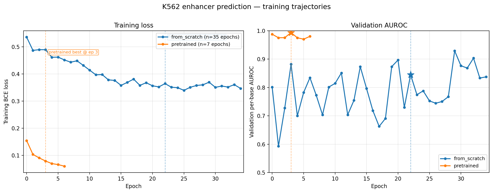
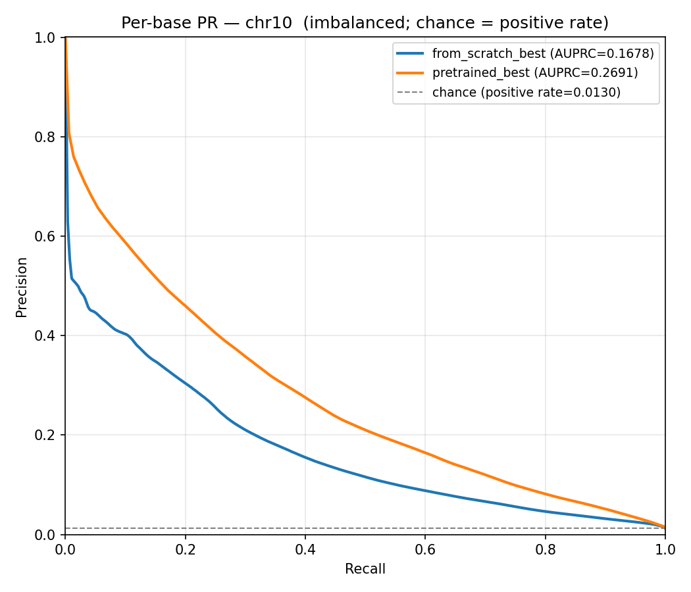
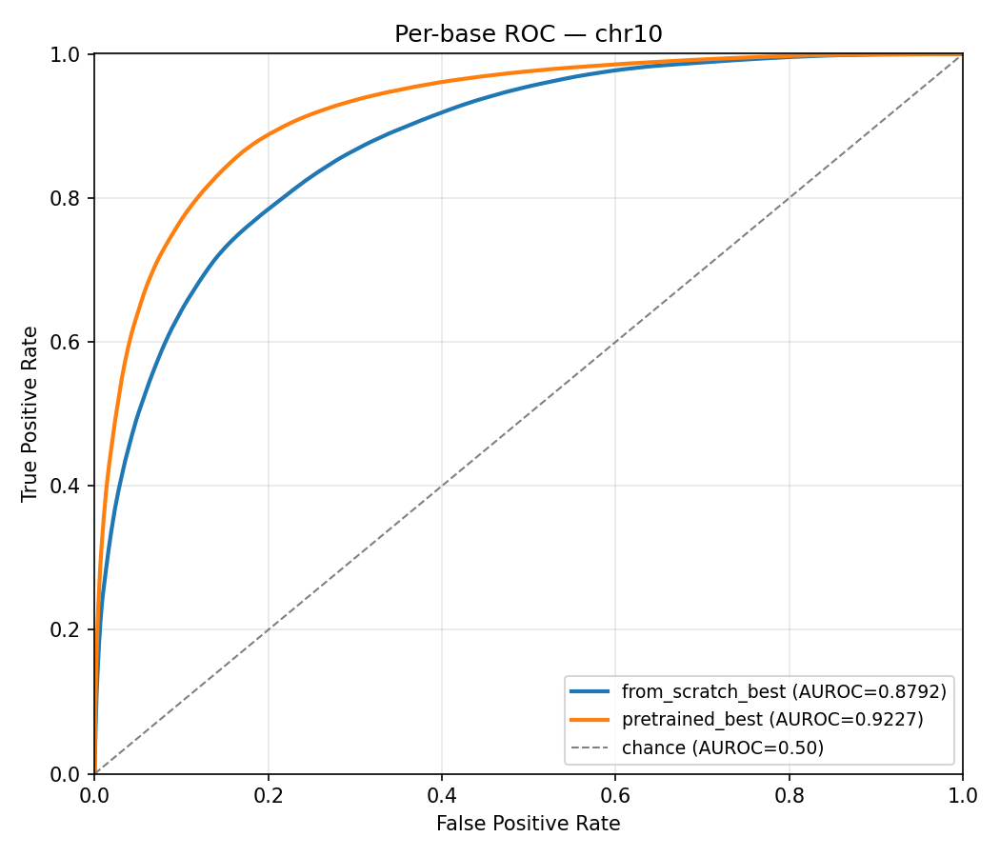
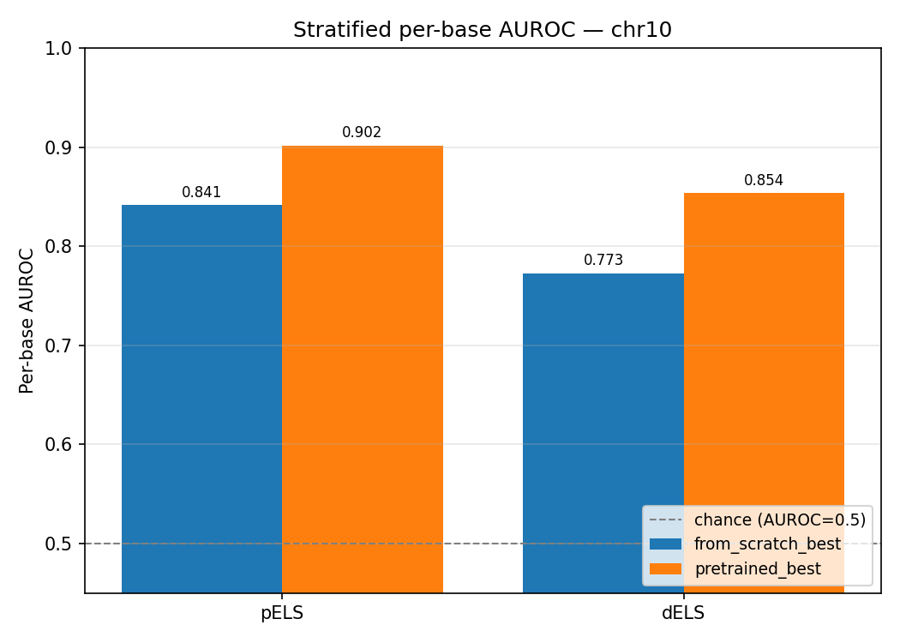
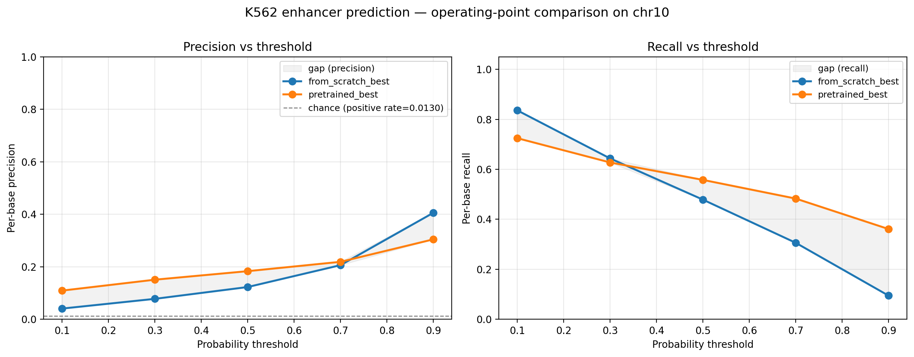
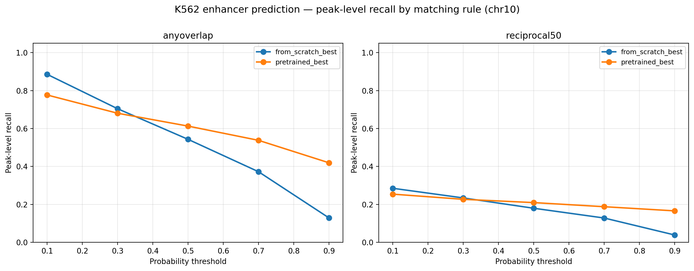
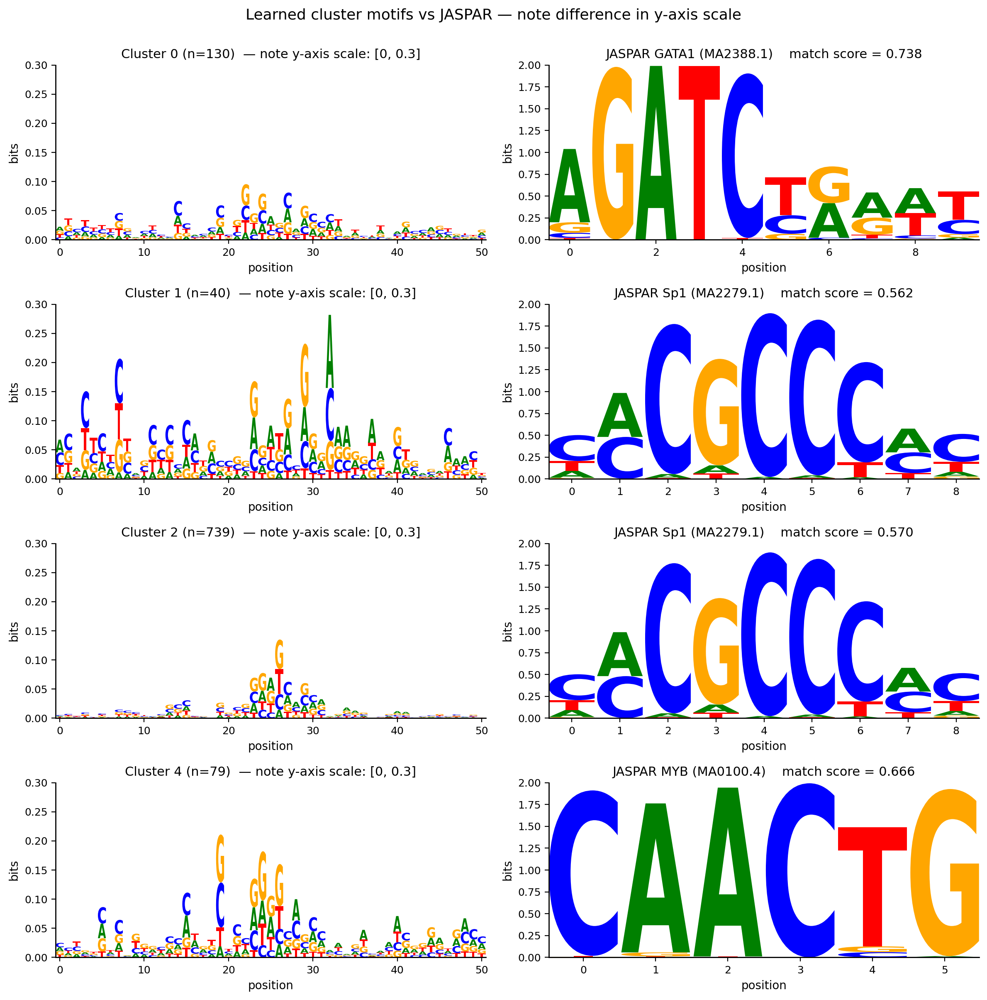
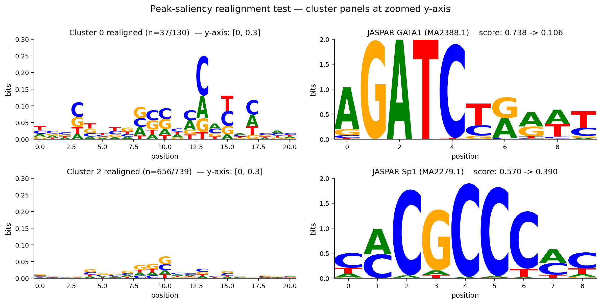

# K562 Enhancer Prediction from DNA Sequence

This project trains a deep learning model to identify K562 enhancer regions from DNA sequence. The main scientific question is whether pretraining on a related task helps. I compared two models with the same architecture, one initialized from scratch and one initialized from Puffin-D pretrained weights, and evaluated both on held-out chromosome 10.

## Background

Enhancers are stretches of DNA that turn on nearby genes. They can sit thousands of bases away from the gene they regulate, and different cell types use different enhancers. K562 is a leukemia cell line derived from erythroid progenitors. Biologists have mapped its enhancers using experimental methods, so ground truth labels exist.

Predicting enhancer activity from sequence alone is biologically meaningful. If a model can do it well, sequence carries enough information to determine enhancer identity, and the model becomes a tool for studying what sequence features matter. The catch is that enhancer prediction is hard. Only about 1% of the genome is an enhancer in any given cell type, so models have to find a rare positive signal in a sea of negatives.

## Scientific question

Puffin-D is a CNN-based architecture originally trained on promoter biology. Promoter and enhancer regulation share some underlying machinery, both involve transcription factors binding short DNA motifs, so weights learned for promoters should transfer in principle.

The hypothesis is that initializing the model from Puffin-D weights produces a better K562 enhancer predictor than training the same architecture from scratch. To test this, I trained two models with identical data, splits, hyperparameters, and architecture. The only difference was initialization. I then evaluated both on a held-out chromosome.

## Data

The model takes 100,000 base pairs of DNA as input and outputs a per-base probability that each position is part of a K562 enhancer. Input sequences are drawn from the GRCh38 (hg38) human reference genome.

Ground truth labels come from intersecting two ENCODE resources. Candidate cis-regulatory elements (cCREs) define genomic intervals with regulatory potential based on accessibility and histone marks. K562 H3K27ac ChIP-seq identifies which cCREs are active in K562 specifically. A base is labeled positive if it falls within a cCRE that overlaps a K562 H3K27ac peak.

The cCRE annotations distinguish two enhancer subcategories that matter for the analysis. Proximal enhancer-like elements (pELS) sit within 2 kb of a transcription start site. Distal enhancer-like elements (dELS) sit further away. The two categories differ biologically. Proximal elements share sequence properties with nearby promoters, while distal elements depend more on cell-type-specific transcription factor binding.

The callable mask marks positions where labels are trustworthy. Repeat-masked regions, centromeres, and low-complexity stretches are excluded. Every metric reported below is computed only over callable positions.

Chromosome splits keep the test set fully separated from training. Chromosomes 1 through 7 and 11 through 20 are training. Chromosome 21 is validation. Chromosome 10 is the test set. Splitting by whole chromosomes prevents any local DNA homology between training and test, which would otherwise inflate metrics.

The positive rate on chr10 is 1.30%, which means a model that guesses randomly would achieve AUPRC of 0.013. This is the chance baseline against which all per-base precision-related metrics should be compared.

## Model

The architecture is Puffin-D, a CNN with dilated convolutions arranged in a double U-Net structure. The 100 kb input passes through a series of strided convolutions that downsample to a bottleneck, then upsample back to per-base resolution. The output head is a single sigmoid layer that produces one probability per base.

I replaced Puffin-D's original output layer with a binary classification head suited for enhancer prediction. Everything else, including the backbone, is unchanged.

Training used binary cross-entropy loss with `pos_weight=25` to address the class imbalance. AdamW optimizer with weight decay 1e-4 and learning rate 2e-3 with plateau decay, reused from prior Puffin-D-backed work in the lab. Each epoch processes 2,500 windows sampled from the training chromosomes. Batch size 4. Mixed precision training on a single GPU.

The two models differ only in their starting weights. The from-scratch model begins with random initialization. The pretrained model begins with Puffin-D's released weights, which were trained on promoter-related tasks. Both are then fine-tuned on K562 enhancer labels using the procedure above.

Training proceeded for as long as validation loss continued to improve. From-scratch trained for 35 epochs. Pretrained converged much faster and stopped at epoch 7.

## Evaluation methodology

The main evaluation is on held-out chromosome 10. The model never saw chr10 during training or validation, so its predictions on chr10 are honest.

I computed several metrics rather than relying on a single number. Each one measures something different, and the picture across all of them tells a fuller story than any one alone.

Per-base AUROC asks whether the model ranks enhancer bases above non-enhancer bases. AUROC has a known weakness on imbalanced problems. Because 98.7% of bases are not enhancers, a model can score high just by correctly handling the easy negatives. AUROC is reported but should not be read in isolation.

Per-base AUPRC is the more honest metric for this problem. It directly tracks how precision and recall trade off as you sweep the threshold. The chance baseline equals the positive rate, which is 0.013 on chr10. A useful model needs to be well above 0.013.

The threshold sweep computes precision and recall at five operating points from 0.1 to 0.9. This shows whether one model dominates another across the full operating range or only at a specific threshold.

Stratified AUROC computes the metric separately for pELS and dELS positions. Proximal elements share signal with promoters and are biologically easier. Distal elements depend more on enhancer-specific features and are harder. Comparing the two reveals whether the model is exploiting easy proximal signal or actually learning enhancer biology.

Peak-level recall asks a different question. Per-base recall counts how many enhancer bases the model finds. Peak-level recall counts how many enhancer regions the model finds. To get peak-level numbers, I threshold the per-base probabilities at 0.5, group consecutive above-threshold bases into predicted regions, and check whether each predicted region overlaps a ground-truth K562 enhancer. Two matching rules are used. Anyoverlap requires only one base of overlap. Reciprocal-50 requires both intervals to cover at least 50% of each other. Reporting both confirms whether the result holds under a strict definition.

## Results

### Training dynamics

The most striking difference between the two models shows up in how they train.



From-scratch needs 35 epochs to reach validation AUROC around 0.93, and its val AUROC bounces between epochs because the validation set is small. Pretrained starts at a much lower training loss, reaches val AUROC above 0.98 within 3 epochs, and converges by epoch 7. The val AUROC curve for from-scratch is noisy because the validation set has only 50 windows, which is why I rely on chr10 test-set evaluation rather than val numbers for final comparisons.

This figure is the clearest visual evidence for the transfer learning hypothesis. The pretrained model needed roughly 5x fewer training epochs to surpass from-scratch's best performance.

### Test set performance

The pretrained model outperforms the from-scratch model on every metric.

| Metric | From-scratch | Pretrained |
|---|---|---|
| Per-base AUROC | 0.879 | 0.923 |
| Per-base AUPRC | 0.168 | 0.269 |
| Per-base precision at threshold 0.5 | 0.123 | 0.184 |
| Per-base recall at threshold 0.5 | 0.479 | 0.558 |

AUPRC is the metric that matters most given the class imbalance. Pretrained's 0.269 is 21 times above the chance baseline of 0.013. From-scratch's 0.168 is 13 times above chance. Pretrained achieves about 60% higher AUPRC than from-scratch on the same task.





### Stratified performance by enhancer subtype

Both models do better on the easier pELS subtype than on dELS, which is expected. From-scratch reaches AUROC 0.841 on pELS and 0.773 on dELS. Pretrained reaches 0.901 on pELS and 0.853 on dELS.



The interesting finding is that pretraining helps more on the harder dELS category. The pELS improvement is 0.060, and the dELS improvement is 0.080. If pretraining had only helped on pELS, the natural interpretation would be that Puffin-D's promoter knowledge transferred but enhancer biology did not. The dELS improvement says otherwise. Whatever the pretrained model picked up generalizes beyond promoter-adjacent regions.

### Robustness across operating points

A single threshold can be cherry-picked, so I checked the comparison across the full sweep.



Pretrained dominates from-scratch on recall at every threshold. On precision, pretrained dominates at every threshold below 0.9. At threshold 0.9, from-scratch has slightly higher precision but recalls only 9% of enhancer bases. Pretrained recalls 36% at the same threshold. The result is not specific to threshold 0.5.

### Peak-level matching

At the level of whole enhancer regions, the pretrained model finds 61% of real chr10 enhancers under lenient matching and 21% under strict reciprocal-50 matching. From-scratch finds 54% and 18% respectively.



The fact that pretrained wins under both matching definitions matters. It rules out the concern that any single matching choice is hiding a weakness.

## Interpretation: what did the model learn?

Strong test-set metrics raise the obvious next question. What is the model actually paying attention to in the DNA sequence? Specifically, did it learn known transcription factor binding motifs that are characteristic of K562 enhancers, or something else?

To answer this I performed in silico mutagenesis on the 1,000 highest-confidence enhancer predictions on chr10. For each of these positions, I mutated every base in a 51 bp window and recorded how much the prediction changed. This produced a saliency profile per position, showing which surrounding bases the model relied on.

I then clustered the 1,000 saliency profiles into 10 groups based on similarity of shape, and for each group built a position weight matrix from the underlying DNA sequences. Each cluster PWM was compared against JASPAR using an IC-weighted Pearson correlation across offset alignments, with a focus on K562-relevant transcription factors including GATA1, MYB, KLF1, SP1, and RUNX1.

### Initial matches looked promising

Four clusters had enough members to be meaningful and scored above 0.55 against the K562 TF list. Cluster 0 with 130 members matched GATA1 at score 0.738. Cluster 1 with 40 members matched Sp1 at 0.562. Cluster 2 with 739 members matched Sp1 at 0.570. Cluster 4 with 79 members matched MYB at 0.666.

At first glance this looks like a strong result. GATA1 is the master regulator of erythroid biology and a defining K562 transcription factor. MYB is canonical in leukemia. Sp1 binds GC-rich regions and is associated with active regulatory elements broadly. A model that independently rediscovered these from sequence alone would be a meaningful finding.

But the cluster PWMs themselves told a more complicated story.



The cluster panels on the left use a zoomed y-axis from 0 to 0.3 bits. The JASPAR panels on the right use the natural 0 to 2 bits range. The dashed line in the cluster panels marks 1.0 bits, which is roughly where a typical TF motif position sits. The visual scale difference is the point. JASPAR motifs have positions with information content reaching 1.5 to 2.0 bits. The cluster PWMs have maximum positions around 0.2 to 0.3 bits, an order of magnitude weaker. The model has positional preferences, but they are not motif-strength.

Looking at the actual letters does not help the GATA1 and MYB cases. Cluster 0 should show A and T enrichment in a GATA-like pattern if the model had learned GATA1, but the cluster's preferences are GC-flavored instead. Cluster 4 should show an A-rich core if the model had learned MYB, but the preferences are again C and G.

The Sp1 matches look more honest. Sp1 binds GC-rich GC-boxes, and the two Sp1-matching clusters do show coherent G and C enrichment. The biology lines up even if the signal is weaker than a real Sp1 site.

### The realignment test

To check whether the initial matches reflected real motif signal or compositional correlation, I performed a sharper test. If a cluster contains a real motif, then realigning each member sequence to its own peak-saliency position should concentrate the signal. Letters that scatter across the 51 bp window when aligned naively should sharpen to a clear peak when aligned by attention.

If instead the cluster has only broad compositional signal with no specific motif position, realignment should weaken the apparent match. Compositional preferences do not have a peak position to align to.

Realignment caused match scores to collapse rather than strengthen. Cluster 0's match to GATA1 dropped from 0.738 to 0.106, a 7x reduction. Cluster 2's match to Sp1 dropped from 0.570 to 0.390. Clusters 1 and 4 lost so many members during realignment that they could not be evaluated.



The realigned panels make the result visible. After aligning each cluster 0 member to its peak-saliency position, the most-attended base is a single C around position 13, not the A and T letters GATA1 binding would require. Cluster 2's realigned PWM is similarly flat across 656 sequences, with only weak GC preference near the center. If a real GATA1 binding site had been driving cluster 0, peak-alignment would have sharpened the signal into a recognizable motif pattern. Instead it picks out a C, which confirms that the model's attention concentrates on regions rather than on specific binding sequences.

### What the model actually learned

Putting all of this together, the picture is more nuanced than a simple story of the model rediscovering known motifs.

The model does attend to specific positional regions inside its windows. Saliency profiles are not flat. The clustering finds groups where attention concentrates in similar places, and the cluster PWMs have visible positional preferences.

But the preferences are GC-flavored rather than TF-motif-specific. Across all four meaningful clusters, the letters at the high-saliency positions are predominantly C and G, with occasional A. None of them reproduce the specific letter patterns of GATA1, MYB, or other canonical K562 TFs at motif strength.

The Sp1 matches are the most defensible. Sp1 binds GC-rich GC-boxes, and the model's GC-rich attention pattern is compositionally consistent with what Sp1 recognizes, even if the signal is much weaker than experimentally derived Sp1 PWMs. The realignment test still weakens the Sp1 match, but less severely than GATA1.

The GATA1 and MYB matches reflect spurious correlation. The IC-weighted Pearson scoring can pick up loose compositional similarity and report it as a match. When the underlying signal is weak and non-motif-like, this produces match scores that look real but are not.

The overall interpretation is that the model leans on compositional features such as GC content and CpG context rather than recognizing specific TF binding sites. This is consistent with the stratified result. The model does best on pELS, where promoter-adjacent compositional cues are strong, and worse on dELS, where prediction depends more on specific motifs. The interpretation analysis and the stratified evaluation tell the same story.

## Discussion

The transfer learning hypothesis is supported. Pretrained outperforms from-scratch on every metric, the improvement is larger on the harder dELS category, and the result holds across thresholds and matching rules. Pretraining is doing real work, not just speeding up training.

The interpretation analysis adds an honest caveat. The model achieves high AUROC and AUPRC, but its sequence reasoning operates at a compositional rather than a motif level. This is not a failure mode. Many real enhancers do depend on broad GC-rich context as much as on specific TF binding sites, particularly in proximal regions. But it does mean the model is not yet a tool for directly extracting K562-specific TF binding rules from sequence alone.

There are several directions worth pursuing. A wider ISM window of 101 or 151 bp might catch motif signal that the 51 bp window misses, since some TF binding contexts span longer ranges. Selecting focal positions by saliency strength rather than by raw predicted probability might enrich for motif-bearing windows. And training with auxiliary objectives that explicitly reward motif-level signal could push the model toward TF-specific representations.

The val set noise is worth acknowledging. With only 50 validation windows, val AUROC bounces by 5 to 10 percentage points epoch to epoch, which makes val-based checkpoint selection less trustworthy. The chr10 test set is large and stable, so the final reported numbers are reliable, but a larger val set would have made training-time decisions easier.

## Repository structure

```
src/                       Importable modules
  dataset.py               PyTorch Dataset for K562 enhancer labels
  model.py                 EnhancerModel: Puffin-D backbone plus classification head
  eval_metrics.py          AUROC, AUPRC, threshold sweep, peak matching, stratified
  ism.py                   In silico mutagenesis and top-position selection
  motifs.py                PWM building, clustering, JASPAR matching

scripts/                   Runnable scripts
  build_enhancer_labels.*  Build chr-wise per-base label arrays from cCREs + H3K27ac
  build_strata.*           Build pELS/dELS per-position strata for chr10
  train.py                 Training loop, used by both train_*.sh wrappers
  train_from_scratch.sh    SLURM wrapper, random initialization
  train_pretrained.sh      SLURM wrapper, Puffin-D initialization
  run_inference.*          Run a trained checkpoint across a chromosome
  evaluate.*               Compute all evaluation metrics on prediction .npz files
  plot_loss_curves.py      Parse training logs and plot loss and val curves
  plot_threshold_sweep.py  Plot per-base precision and recall vs threshold
  plot_motif_matches.py    Side-by-side cluster-vs-JASPAR motif logos
  realign_and_replot.py    Peak-saliency realignment test
  run_ism.*                ISM on top-1000 predictions
  extract_motifs.*         Cluster saliency profiles, build PWMs, save logos
  match_jaspar.*           Tomtom-style PWM matching against JASPAR

eval/                      Evaluation results: figures and JSON
interpretation/            Motif analysis results: figures, JSON, small .npz
requirements.txt           Python dependencies
```

## Reproduction

The training and inference scripts assume a specific compute environment. They were developed on the Zhou Lab's randi cluster at UChicago, with Blackwell GPUs and a conda environment named `af_constraint`. Some steps require access to large reference files that are not in this repo.

External dependencies beyond what pip can install:

The hg38 reference genome. The scripts expect a packbits-format version produced by selene_mini, the Zhou Lab's fork of Selene. This is not a pip-installable package. See the lab's GitHub for related tools, or contact the lab for setup.

ENCODE cCRE annotations and K562 H3K27ac peak calls. Available from the ENCODE portal.

JASPAR 2024 CORE vertebrates non-redundant PFMs, downloadable from https://jaspar.genereg.net.

The Python dependencies are listed in `requirements.txt`. After cloning the repo and creating a Python 3.10 or higher environment:

```bash
pip install -r requirements.txt
```

To reproduce the pipeline end to end, the rough order is:

1. Build per-base label arrays from cCREs and H3K27ac: `scripts/build_enhancer_labels.sh`
2. Build the pELS/dELS strata for chr10: `scripts/build_strata.sh`
3. Train the two models: `scripts/train_from_scratch.sh` and `scripts/train_pretrained.sh`
4. Run inference on chr10: `scripts/run_inference.sh`
5. Compute evaluation metrics: `scripts/evaluate.sh`
6. Run ISM on top predictions: `scripts/run_ism.sh`
7. Extract motifs: `scripts/extract_motifs.sh`
8. Match against JASPAR: `scripts/match_jaspar.sh`
9. Generate the plots: `scripts/plot_loss_curves.py`, `scripts/plot_threshold_sweep.py`, `scripts/plot_motif_matches.py`, `scripts/realign_and_replot.py`

Each script has reasonable defaults, but cluster paths are hardcoded in most of them. Adjust paths for your environment.

Model checkpoints and full chromosome prediction arrays are too large to commit. They can be regenerated by running the pipeline.

## Acknowledgments

The Puffin-D architecture and pretrained weights come from the Zhou Lab at UChicago. ENCODE provides the cCRE annotations and K562 H3K27ac data used as ground truth. JASPAR provides the TF motif database used for interpretation. This work was completed as a final project for Deep Learning in Genomics, Spring 2026.
